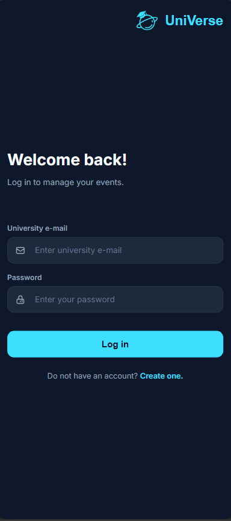
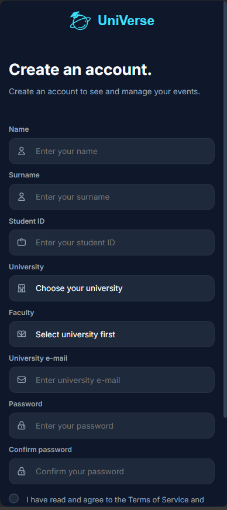
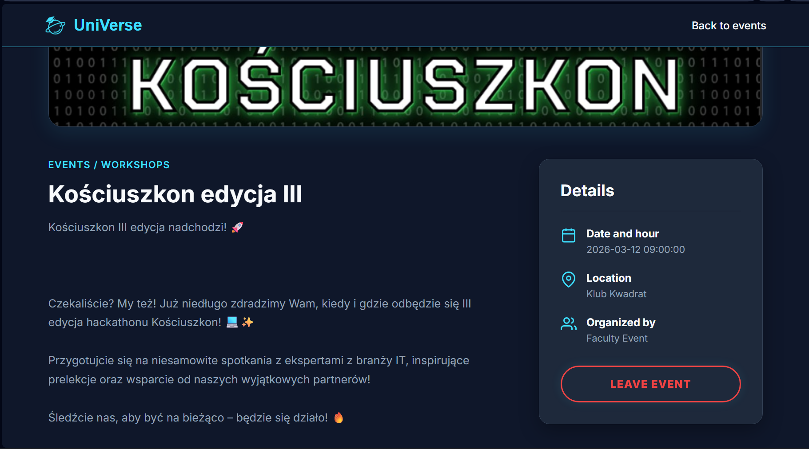
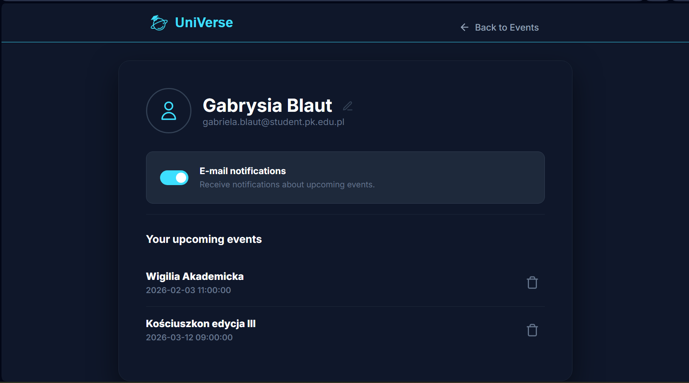
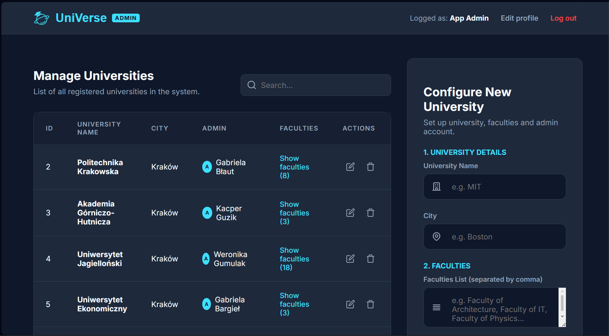
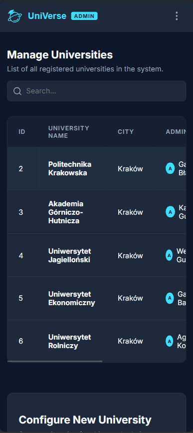
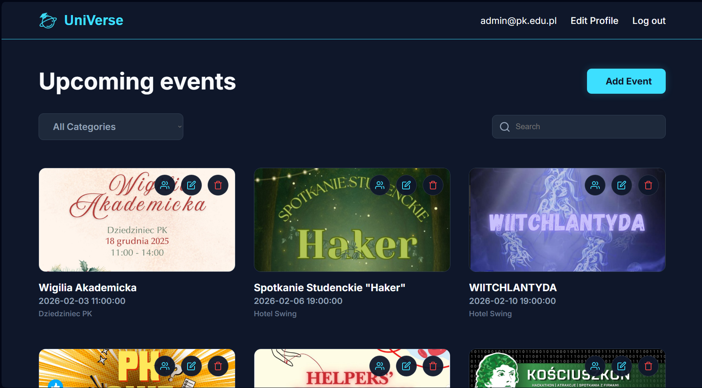
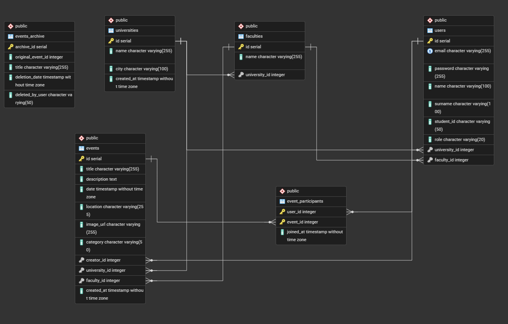

# 🌌 UniVerse - University Event Manager


> Modern platform for managing university life, events, and student integration.

---

## 📸 Interface Preview

### 🏠 Landing Page
The first point of contact for users. It presents the platform's main goal: integrating the academic community through events.
* **Functionality:** Provides clear navigation to login and registration modules.
* **Responsiveness:** Layout automatically adjusts from a wide hero section on desktop to a vertical stack on mobile devices.
  
| Desktop View | Mobile View |
| :--- | :--- |
|  |  |

---

### 🔐 Authentication (Login & Register)
Secure access gateway for all university members.
* **Smart Forms:** Registration features a dynamic faculty selector that updates via AJAX based on the chosen university.
* **Security:** Protects user credentials using password hashing and defined database roles.
  
| Page | Desktop | Mobile |
| :--- | :---: | :---: |
| **Login** |  |  |
| **Register** |  |  |

---

### 🎓 Student Experience
The central hub for discovering and participating in university life.
* **Discovery:** Real-time search engine allows filtering events by title or category without page reloads.
* **Interaction:** Students can join events with one click, triggering an automatic email confirmation via PHPMailer.
* **Profile:** Dedicated space to manage personal details and track all joined events.
  
| Feature | Desktop View | Mobile View |
| :--- | :---: | :---: |
| **Dashboard** |  |  |
| **Event Page** |  |  |
| **Profile** |  |  |

---

### 🛡️ Administration Panels
Specialized tools for managing the UniVerse platform.
* **App Admin:** Manages global system entities like universities and their respective faculties.
* **Uni Admin:** Monitors specific event participation and manages local event data.
  
| Role | Dashboard Preview | Mobile View |
| :--- | :---: | :---: |
| **App Admin** |  |  |
| **Uni Admin** |  |  |

## 🚀 Installation & Setup

This project is fully containerized using **Docker**, eliminating the need for local PHP or PostgreSQL installations.

### 📋 Prerequisites
* **Docker Desktop** installed and running.
* **Git** for cloning the repository.

### 🛠️ Quick Start

1. **Clone the repository**
2. **Build and start the containers**
   ```bash
   docker-compose up -d --build
3. **Install PHP dependencies**
   ```bash
   docker exec -it php composer install
4. **Initialize the Database**
   ```bash
   docker exec -i db psql -U docker -d db < database.sql

## 📊 Database Architecture 

The UniVerse platform utilizes a relational PostgreSQL database designed with specific constraints, triggers, and functions to ensure data integrity and automate core academic management tasks.

### 📂 Table Structures & Relationships

| Table | Description | Key Relationships |
| :--- | :--- | :--- |
| **universities** | Central registry of academic institutions, storing names and locations. | Parent to **faculties**, **users**, and **events**. |
| **faculties** | Academic departments within a specific university. | Linked to **universities** (1:N) with `ON DELETE CASCADE`. |
| **users** | Profiles for students and administrators, including role-based access levels. | Linked to **universities** and **faculties** (N:1). |
| **events** | Core table for gatherings, including date, category, and target university/faculty. | Created by **users**; tied to specific institutions and departments. |
| **event_participants** | Enrollment table managing student attendance at specific events. | Many-to-Many link between **users** and **events**. |
| **events_archive** | Audit log for deleted records, ensuring historical data preservation. | Records metadata from **events** after a deletion trigger fires. |

### 🔗 Key Relational Logic
* **Data Hierarchy:** The system enforces a strict hierarchy where every faculty must belong to a university. Users and events are primary-linked to universities to ensure localized content.
* **Integrity Constraints:** Most relationships use `ON DELETE CASCADE` (e.g., removing a university removes its faculties and events) or `SET NULL` for user profiles to maintain consistency.
* **Unique Enrollment:** The `event_participants` table uses a composite primary key (`user_id`, `event_id`) to prevent duplicate sign-ups for the same event.

### ⚡ Advanced Database Logic (Triggers & Functions)
The database handles business logic directly through PL/pgSQL to guarantee safety regardless of the application state:
* **Future Date Validation:** The `trigger_validate_event_date` ensures that new or updated events can only be set for future dates.
* **Enrollment Guard:** A specialized trigger on `event_participants` prevents users from joining an event that has already taken place.
* **Automatic Archiving:** The `trigger_archive_events` automatically moves metadata to the `events_archive` table whenever an event is deleted from the main registry.

### 👁️ Optimized Data Access
* **Upcoming Events View:** The `vw_upcoming_events` view provides an optimized join of events, universities, and faculties, filtered to show only future gatherings.

<p align="center">
  
</p>

## 🔒 Security Measures

Following industry best practices (PHP Security Bingo), the project implements critical defense mechanisms to ensure data safety and system integrity:

### 1. SQL Injection Protection (Prepared Statements)
All database interactions utilize **PDO Prepared Statements**. User input is never concatenated directly into SQL queries, effectively eliminating SQL injection risks.
* **Implementation:** Strict use of `bindParam()` and `execute()` in all repositories.
* *Example:* `SELECT ... WHERE email = :email` instead of insecure string concatenation.

### 2. Brute-Force Protection (Rate Limiting)
The authentication system includes a lockout mechanism to prevent brute-force attacks.
* **Rule:** 5 failed login attempts from the same IP address trigger a temporary 60-second lockout.
* **Auditing:** Every failed attempt is logged (`error_log`) for security monitoring.

### 3. CSRF Protection (Cross-Site Request Forgery)
Login and registration forms are secured with a unique, session-based `csrf_token`. The server validates this token for every POST request, rejecting any unauthorized submissions.

### 4. User Enumeration Prevention
The system is designed not to reveal whether a specific email address exists in the database. In case of authentication errors (wrong password, user not found), a generic message is always returned: `Incorrect email or password!`.

### 5. Enforced HTTPS (SSL/TLS)
The application is configured at the Nginx server level to enforce encrypted connections. All HTTP traffic (port 80) is automatically redirected to HTTPS (port 443) using a 301 Permanent Redirect.

### 6. Session Security (Anti-Fixation)
Upon successful login, the session identifier is automatically regenerated using `session_regenerate_id(true)`. This prevents Session Fixation attacks where an attacker tries to hijack a valid user session.

### 7. Strong Password Policy
Registration enforces password complexity using Regex validation. Passwords must include:
* Uppercase and lowercase letters,
* A digit,
* A special character.
Passwords are then hashed using the secure `password_hash` function with the `PASSWORD_DEFAULT` algorithm.
